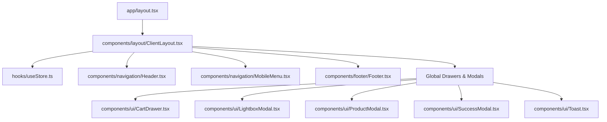

# MARK Architects - Legacy Architectural Brain (`Brains.md`)

This document serves as the project's permanent memory (the "Brain") detailing the transition from the legacy static HTML structure to a modern, production-grade **Next.js 16** & **React 19** application, reconciled with the client-approved authoritative service catalog, pricing rules, Safepay gateway, and Phase 3/4 specifications.

---

## 1. System Architecture & Component Hierarchy

The project is structured around a centralized layout tree that wraps next-generation React components and binds them to a single Zustand-driven client state store.

---

## 2. Core Tech Stack & Dependency Matrix

| Dependency              | Purpose                 | Details                                                                              |
| :---------------------- | :---------------------- | :----------------------------------------------------------------------------------- |
| **Next.js 16.2.9**      | Application Framework   | File-based App Router, optimization pipelines                                        |
| **React 19.2.4**        | UI Rendering Engine     | Concurrent rendering and modern state patterns                                       |
| **TypeScript 5.x**      | Static Type Safety      | Strict schemas, interface configurations                                             |
| **Tailwind CSS v4**     | Design System           | PostCSS `@theme` mapping for clean styling tokens                                    |
| **Zustand 5.0.14**      | Global State Store      | Unidirectional state management (Cart, Modals, Calendar, Attachments)                |
| **Safepay API**         | Payment Processor       | **Primary gateway** for PKR consultations, design packages & 50% advance deposits    |
| **Supabase PostgreSQL** | Cloud Database & RLS    | Normalized tables for services, tiers, plot-based pricing, consultations, and orders |
| **Framer Motion 12**    | Fluid Interface Motion  | Smooth page entries, hover scales, filter transitions                                |
| **Lenis 1.3.25**        | Premium Kinetic Scroll  | Smooth scroll interpolation                                                          |
| **Zod & Hook Form**     | Form Logic & Validation | Zod schema parsing, client-side validation & mandatory attachment gating             |
| **Lucide Icons**        | Design Iconography      | Standard Lucide icon vectors                                                         |

---

## 3. Authoritative Service Catalog & Pricing Models (PKR)

All services follow client-approved pricing and specifications:

1. **Online Consultation (Video / Call)**:
   - Basic Call: 30 min (PKR 3,000)
   - Premium Call: 60 min (PKR 5,000)
   - _Requirement: Mandatory drawing or site photo attachment before call confirmation._
2. **House Plan Review by Professional Architect**:
   - Basic: 24 hrs (PKR 5,000)
   - Standard: 24–48 hrs (PKR 9,000)
   - Premium: 48 hrs (PKR 24,000)
3. **House Plan Correction**:
   - 5 Marla / 10 Marla / 1 Kanal plot-based tiers
   - Basic: PKR 10k / 15k / 26k
   - Standard: PKR 15k / 22k / 40k
   - Premium: PKR 22k / 38k / 70k
4. **Front Elevation 3D (Exterior Render)**:
   - 5 Marla / 10 Marla / 1 Kanal plot-based tiers
   - Basic: PKR 15k / 17k / 23k
   - Standard: PKR 20k / 25k / 31.9k
   - Premium: PKR 25k / 29k / 36k
5. **Interior Room Makeover**:
   - Basic: PKR 7,000 (2 days)
   - Standard: PKR 12,000 (3–4 days)
   - Premium: PKR 30,000 (5–7 days)
6. **Construction Cost Estimate (Grey Structure)**:
   - 5 Marla / 10 Marla / 1 Kanal plot-based tiers
   - Basic: PKR 5k / 7k / 9k
   - Detailed: PKR 16k / 19k / 30k
7. **Full House Design Package (Dynamic Rate-Based)**:
   - Calculated live: Covered area (sq. ft.) × discipline rate
   - Architectural (40), Structural (8), Plumbing (3.5), Electrical (4.5), Fire/Safety (1)
   - **50% advance payment required** to initiate work.

---

## 4. Directory Blueprint & Module Responsibilities

### 📂 `app/` (Routing & Layouts)

- **[layout.tsx](file:///Users/muhammadrafiq/Desktop/ZiriumAI/projects/Mark%20Architeture/mark-archit/app/layout.tsx)**: Configures Google Fonts, sets HTML metadata, and mounts the root ClientLayout.
- **[page.tsx](file:///Users/muhammadrafiq/Desktop/ZiriumAI/projects/Mark%20Architeture/mark-archit/app/page.tsx)**: Home page implementing a fullscreen parallax hero, floating statistic panels, and atelier principles.
- **[about/page.tsx](file:///Users/muhammadrafiq/Desktop/ZiriumAI/projects/Mark%20Architeture/mark-archit/app/about/page.tsx)**: Practice leadership profiles with credentials (PCATP, RIBA, SIA), 15+ years experience, and project achievements.
- **[portfolio/page.tsx](file:///Users/muhammadrafiq/Desktop/ZiriumAI/projects/Mark%20Architeture/mark-archit/app/portfolio/page.tsx)**: Filterable project gallery with full-size lightbox viewer.
- **[services/page.tsx](file:///Users/muhammadrafiq/Desktop/ZiriumAI/projects/Mark%20Architeture/mark-archit/app/services/page.tsx)**: 7 Approved services organized by priority rank with interactive tier tabs, plot selectors, dedicated inquiry modals, and live Quote Calculator.
- **[collection/page.tsx](file:///Users/muhammadrafiq/Desktop/ZiriumAI/projects/Mark%20Architeture/mark-archit/app/collection/page.tsx)**: Standardized architectural design packages with direct checkout capabilities and bespoke physical artifacts.
- **[consultation/page.tsx](file:///Users/muhammadrafiq/Desktop/ZiriumAI/projects/Mark%20Architeture/mark-archit/app/consultation/page.tsx)**: Dual consultation booking featuring call tier picker, calendar slot locking, and **mandatory drawing attachment** validation.

### 📂 `components/` (Reusable Interface Blocks)

- **`calculator/`**:
  - **[FullHouseCalculator.tsx](file:///Users/muhammadrafiq/Desktop/ZiriumAI/projects/Mark%20Architeture/mark-archit/components/calculator/FullHouseCalculator.tsx)**: Live quote breakdown for Full House Design Package showing cumulative discipline rates, total estimate, and 50% advance deposit.
- **`ui/`**:
  - **[CartDrawer.tsx](file:///Users/muhammadrafiq/Desktop/ZiriumAI/projects/Mark%20Architeture/mark-archit/components/ui/CartDrawer.tsx)**: Slide-out drawer tracking order acquisitions, PKR total calculations, and Safepay checkout integration.

### 📂 `lib/` & `supabase/`

- **[safepay.ts](file:///Users/muhammadrafiq/Desktop/ZiriumAI/projects/Mark%20Architeture/mark-archit/lib/safepay.ts)**: Helper class for Safepay API session creation, 50% advance math, and PKR formatting.
- **[schema.sql](file:///Users/muhammadrafiq/Desktop/ZiriumAI/projects/Mark%20Architeture/mark-archit/supabase/schema.sql)**: Complete PostgreSQL DDL with RLS policies, indexes, and full seed data.
