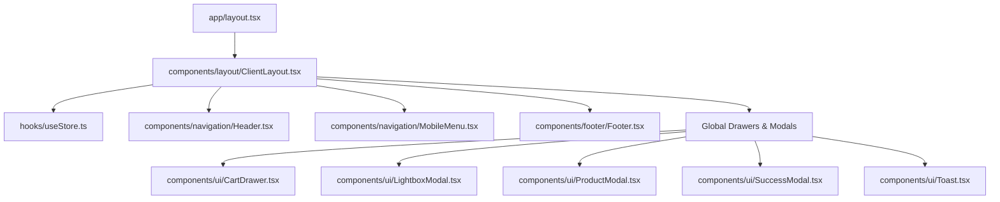

# MARK Architects - Legacy Architectural Brain (`Brains.md`)

This document serves as the project's permanent memory (the "Brain") detailing the transition from the legacy static HTML structure to a modern, production-grade **Next.js 16** & **React 19** application. It captures the system architecture, file maps, technical stack definitions, state management, design philosophies, and critical development checklists.

---

## 1. System Architecture & Component Hierarchy

The project is structured around a centralized layout tree that wraps next-generation React components and binds them to a single Zustand-driven client state store.



---

## 2. Core Tech Stack & Dependency Matrix

The application leverages high-performance libraries matching strict rules outlined in `AGENTS.md`:

| Dependency | Purpose | Details |
| :--- | :--- | :--- |
| **Next.js 16.2.9** | Application Framework | File-based App Router, optimization pipelines |
| **React 19.2.4** | UI Rendering Engine | Concurrent rendering and modern state patterns |
| **TypeScript 5.x** | Static Type Safety | Strict schemas, interface configurations |
| **Tailwind CSS v4** | Design System | PostCSS `@theme` mapping for clean styling tokens |
| **Zustand 5.0.14** | Global State Store | Unidirectional state management (Cart, Modals, Calendar) |
| **Framer Motion 12** | Fluid Interface Motion | Smooth page entries, hover scales, filter transitions |
| **Lenis 1.3.25** | Premium Kinetic Scroll | Smooth scroll interpolation |
| **Zod & Hook Form** | Form Logic & Validation | Zod schema parsing and React Hook Form bindings |
| **Lucide Icons** | Design Iconography | Standard Lucide icon vectors |

---

## 3. Directory Blueprint & Module Responsibilities

The codebase organizes files systematically into logical directories:

### 📂 `app/` (Routing & Layouts)
* **[layout.tsx](file:///Users/muhammadrafiq/Desktop/ZiriumAI/mark-archit/app/layout.tsx)**: Configures Google Fonts (*Playfair Display*, *Inter*, *Montserrat*) as CSS variables, sets HTML metadata (SEO, OpenGraph, Twitter cards), and mounts the root ClientLayout.
* **[page.tsx](file:///Users/muhammadrafiq/Desktop/ZiriumAI/mark-archit/app/page.tsx)**: Home page implementing a fullscreen parallax hero, floating statistic panels, core philosophy disclosures, and a featured selected works carousel.
* **[about/page.tsx](file:///Users/muhammadrafiq/Desktop/ZiriumAI/mark-archit/app/about/page.tsx)**: Presents Marcus Vance and Ayla Sterling's journey alongside detailed maps of their physical office ateliers in Zurich, London, and Tokyo.
* **[portfolio/page.tsx](file:///Users/muhammadrafiq/Desktop/ZiriumAI/mark-archit/app/portfolio/page.tsx)**: Houses the interactive gallery grid with dynamic category buttons (All, Residential, Commercial, etc.) and a full-size lightbox viewer.
* **[services/page.tsx](file:///Users/muhammadrafiq/Desktop/ZiriumAI/mark-archit/app/services/page.tsx)**: Showcases the 6 principal architectural domains alongside a direct consultation CTA banner.
* **[collection/page.tsx](file:///Users/muhammadrafiq/Desktop/ZiriumAI/mark-archit/app/collection/page.tsx)**: A high-end product store containing curated interior artifacts, order forms, and the interactive OrbitViewer.
* **[consultation/page.tsx](file:///Users/muhammadrafiq/Desktop/ZiriumAI/mark-archit/app/consultation/page.tsx)**: An advanced dual consultation flow featuring a monthly calendar appointment selector and a Zod-validated design brief form.

### 📂 `components/` (Reusable Interface Blocks)
* **`layout/`**:
  * **[ClientLayout.tsx](file:///Users/muhammadrafiq/Desktop/ZiriumAI/mark-archit/components/layout/ClientLayout.tsx)**: Coordinates global initialization of Lenis scrolling and houses the top-level modals and drawer shells.
* **`navigation/`**:
  * **[Header.tsx](file:///Users/muhammadrafiq/Desktop/ZiriumAI/mark-archit/components/navigation/Header.tsx)**: Sticky header navbar, handles page route highlight states and tracks active shopping cart counts.
  * **[MobileMenu.tsx](file:///Users/muhammadrafiq/Desktop/ZiriumAI/mark-archit/components/navigation/MobileMenu.tsx)**: Responsive slider overlay for navigation on touch interfaces.
* **`collection/`**:
  * **[OrbitViewer.tsx](file:///Users/muhammadrafiq/Desktop/ZiriumAI/mark-archit/components/collection/OrbitViewer.tsx)**: Implements custom 3D CSS transforms allowing users to tilt, zoom, and drag obsidian vases and lounger blueprints on mouse action.
* **`footer/`**:
  * **[Footer.tsx](file:///Users/muhammadrafiq/Desktop/ZiriumAI/mark-archit/components/footer/Footer.tsx)**: Premium editorial footer incorporating location studios and copyright policies.
  * **Note**: Displays office locations and links.
* **`ui/`**:
  * **[ScrollReveal.tsx](file:///Users/muhammadrafiq/Desktop/ZiriumAI/mark-archit/components/ui/ScrollReveal.tsx)**: Framer Motion wrapper executing soft directional slide-in fades upon scroll viewport visibility.
  * **[LightboxModal.tsx](file:///Users/muhammadrafiq/Desktop/ZiriumAI/mark-archit/components/ui/LightboxModal.tsx)**: High-resolution full-screen project image overlays.
  * **[CartDrawer.tsx](file:///Users/muhammadrafiq/Desktop/ZiriumAI/mark-archit/components/ui/CartDrawer.tsx)**: Slide-out drawer tracking acquisitions, subtotal sums, and checking out flows.
  * **[ProductModal.tsx](file:///Users/muhammadrafiq/Desktop/ZiriumAI/mark-archit/components/ui/ProductModal.tsx)**: Quick view pop-up detailing specific collection features.
  * **[SuccessModal.tsx](file:///Users/muhammadrafiq/Desktop/ZiriumAI/mark-archit/components/ui/SuccessModal.tsx)**: Graceful success verification window for reservations and store checkouts.
  * **[Toast.tsx](file:///Users/muhammadrafiq/Desktop/ZiriumAI/mark-archit/components/ui/Toast.tsx)**: Floating popup alerts triggered during global state additions.

### 📂 `hooks/` & `lib/` (Utilities & State)
* **[useStore.ts](file:///Users/muhammadrafiq/Desktop/ZiriumAI/mark-archit/hooks/useStore.ts)**: Unified Zustand client store containing states and actions for:
  * Navigation/Menu toggles (`mobileMenuOpen`, `cartDrawerOpen`).
  * E-Commerce cart arrays, count subtotals, and addition/removal logic.
  * Active modal objects for Lightbox, QuickView, and Success states.
  * Scheduling calendar controls (month offsets, active slot selections, and brief linkage).
  * Auto-hiding toast messages.
* **[utils.ts](file:///Users/muhammadrafiq/Desktop/ZiriumAI/mark-archit/lib/utils.ts)**: Standard utility wrapping `clsx` and `tailwind-merge` to handle dynamic style overlays cleanly.

---

## 4. Crucial Architectural Implementations & Styling Paradigms

### 🎨 Tailwind CSS v4 Theme Token Registry (`globals.css`)
Tailwind CSS v4 configures tokens inline via the `@theme` directive, avoiding a standalone config file. Key color tokens and spacings defined:
* **Backgrounds & Surfaces**: `--color-surface` (`#fcf8f8`), `--color-surface-container` (`#f1edec`), and dark options.
* **Accent Color**: `--color-tertiary` (`#7e5714` - Luxury Bronze).
* **Margins & Spacing**: `--spacing-margin-desktop` (`80px`) and `--spacing-container-max` (`1440px`).
* **Visual Styling**: `.glass-panel` (45% white background with `24px` backdrop-blur blur and transparent borders) and `.glass-panel-dark`.

### ⚡ Interactive 3D Orbit Mechanics
To maintain high performance without downloading heavy WebGL libraries (Three.js), `OrbitViewer.tsx` calculates rotational coordinates manually:
* Dragging tracks pointer delta and offsets coordinates.
* Renders a fluid tilting view using inline 3D CSS:
  ```css
  perspective(1000px) rotateY(Y_deg) rotateX(X_deg) scale(Zoom)
  ```
* Leverages CSS transitions for smooth centering when the cursor leaves the frame.

---

## 5. Development Guidelines & Enhancement Checklist

To preserve the elite standard of the codebase and adhere to guidelines, all future iterations must follow this code checklist:

* [ ] **Replace Legacy Image Elements**: Go through component cards (e.g., in `app/portfolio/page.tsx` line 147) and swap native `` tags for Next.js `Image` components configured with correct `sizes` and proper lazy loading formats.
* [ ] **Accessibility Compliance**: Verify that keyboard navigation (`Tab` index cycling) and ARIA support (`aria-expanded`, `aria-hidden`) are properly configured across all dynamic modal and drawer interfaces.
* [ ] **Dynamic Metadata SEO Rules**: Move metadata setup from root levels into per-page specific static exports or dynamic configurations matching current layout structures.
* [ ] **CMS & Payment Integrations**: Ensure any Stripe integrations or headless CMS connectors (Sanity/Contentful) hook cleanly into the hooks structures inside the store.
