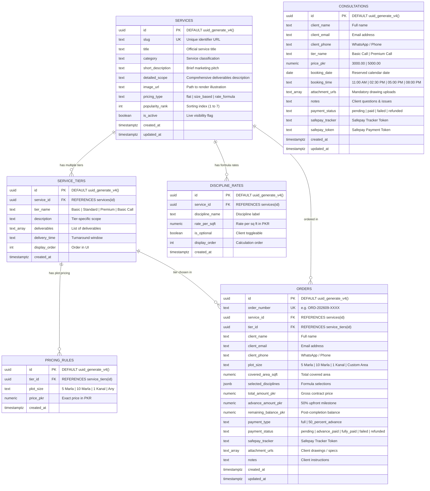

# MARK Architects — Database Schema & Architecture Specification

This document provides the authoritative technical reference for the **MARK Architects** PostgreSQL database hosted on **Supabase**. It covers the complete data architecture: entity-relationship diagrams (ERD), full table definitions, column types, constraints, foreign key relationships, indexes, Row-Level Security (RLS) policies, storage buckets, and seed data mapping.

---

## 1. Architectural Overview

- **Database Engine**: PostgreSQL 15+ (Supabase)
- **Primary Currency**: Pakistani Rupee (`PKR`)
- **Key Extensions**:
  - `uuid-ossp`: Universally Unique Identifier generation (`uuid_generate_v4()`)
- **Security**: Row-Level Security (RLS) enabled on all 6 application tables with anonymous/client role boundaries.
- **Storage**: Supabase Storage bucket `client-attachments` configured for architectural blueprints and site photos (25MB limit).
- **Payment Processing**: Integrated with **Safepay** (tracking tokens, status lifecycle, 50% advance milestone math).

---

## 2. Entity-Relationship Diagram (ERD)



---

## 3. Detailed Table Definitions & Data Dictionaries

### 3.1 Table: `public.services`

Stores the master catalog of all approved architectural and design services.

| Column              | Data Type     | Nullable | Default              | Constraints / Validation                          | Description                                                  |
| :------------------ | :------------ | :------- | :------------------- | :------------------------------------------------ | :----------------------------------------------------------- |
| `id`                | `UUID`        | **NO**   | `uuid_generate_v4()` | `PRIMARY KEY`                                     | Unique immutable service identifier                          |
| `slug`              | `TEXT`        | **NO**   | —                    | `UNIQUE`                                          | URL-friendly unique identifier (e.g. `house-plan-review`)    |
| `title`             | `TEXT`        | **NO**   | —                    | —                                                 | Formal commercial title of the service                       |
| `category`          | `TEXT`        | **NO**   | —                    | —                                                 | Classification (e.g. `Diagnostic Audit`, `3D Visualization`) |
| `short_description` | `TEXT`        | **NO**   | —                    | —                                                 | 1–2 sentence marketing & value pitch                         |
| `detailed_scope`    | `TEXT`        | YES      | `NULL`               | —                                                 | Exhaustive overview of technical methodology                 |
| `image_url`         | `TEXT`        | YES      | `NULL`               | —                                                 | Path to static render (e.g. `/images/House Plan review.png`) |
| `pricing_type`      | `TEXT`        | **NO**   | —                    | `CHECK IN ('flat', 'size_based', 'rate_formula')` | Pricing logic model                                          |
| `popularity_rank`   | `INT`         | YES      | `0`                  | —                                                 | Priority rank on homepage & sidebar (1 = Highest)            |
| `is_active`         | `BOOLEAN`     | YES      | `true`               | —                                                 | Whether the service is visible to clients                    |
| `created_at`        | `TIMESTAMPTZ` | YES      | `now()`              | —                                                 | Record creation timestamp                                    |
| `updated_at`        | `TIMESTAMPTZ` | YES      | `now()`              | —                                                 | Record last update timestamp                                 |

#### Indexes:

- `idx_services_slug`: B-Tree on `public.services(slug)`
- `idx_services_popularity`: B-Tree on `public.services(popularity_rank ASC)`

---

### 3.2 Table: `public.service_tiers`

Stores the delivery tiers associated with each service (e.g., Basic, Standard, Premium).

| Column          | Data Type     | Nullable | Default              | Constraints / Validation                           | Description                                               |
| :-------------- | :------------ | :------- | :------------------- | :------------------------------------------------- | :-------------------------------------------------------- |
| `id`            | `UUID`        | **NO**   | `uuid_generate_v4()` | `PRIMARY KEY`                                      | Unique tier identifier                                    |
| `service_id`    | `UUID`        | **NO**   | —                    | `REFERENCES public.services(id) ON DELETE CASCADE` | Foreign key to parent service                             |
| `tier_name`     | `TEXT`        | **NO**   | —                    | —                                                  | Label (e.g. `Basic`, `Standard`, `Premium`, `Basic Call`) |
| `description`   | `TEXT`        | **NO**   | —                    | —                                                  | Summary of tier capabilities and scope                    |
| `deliverables`  | `TEXT[]`      | YES      | `'{}'`               | —                                                  | Array of bulleted deliverables                            |
| `delivery_time` | `TEXT`        | YES      | `NULL`               | —                                                  | Turnaround time (e.g. `24 Hours`, `3–5 Days`, `2 Weeks`)  |
| `display_order` | `INT`         | YES      | `0`                  | —                                                  | Visual position of tier (0, 1, 2)                         |
| `created_at`    | `TIMESTAMPTZ` | YES      | `now()`              | —                                                  | Record creation timestamp                                 |

#### Indexes:

- `idx_service_tiers_service_id`: B-Tree on `public.service_tiers(service_id)`

---

### 3.3 Table: `public.pricing_rules`

Maps service tiers to plot sizes (`5 Marla`, `10 Marla`, `1 Kanal`, or `Any`) with fixed PKR pricing.

| Column       | Data Type       | Nullable | Default              | Constraints / Validation                                | Description                                |
| :----------- | :-------------- | :------- | :------------------- | :------------------------------------------------------ | :----------------------------------------- |
| `id`         | `UUID`          | **NO**   | `uuid_generate_v4()` | `PRIMARY KEY`                                           | Unique pricing rule identifier             |
| `tier_id`    | `UUID`          | **NO**   | —                    | `REFERENCES public.service_tiers(id) ON DELETE CASCADE` | Foreign key to service tier                |
| `plot_size`  | `TEXT`          | **NO**   | `'Any'`              | `CHECK IN ('5 Marla', '10 Marla', '1 Kanal', 'Any')`    | Pakistani standard plot scale or universal |
| `price_pkr`  | `NUMERIC(12,2)` | **NO**   | —                    | —                                                       | Price in Pakistani Rupees                  |
| `created_at` | `TIMESTAMPTZ`   | YES      | `now()`              | —                                                       | Record creation timestamp                  |

#### Constraints:

- `uq_tier_plot_size`: `UNIQUE (tier_id, plot_size)`

#### Indexes:

- `idx_pricing_rules_tier`: B-Tree on `public.pricing_rules(tier_id)`

---

### 3.4 Table: `public.discipline_rates`

Defines square-foot unit rates for the **Full House Design Package (Rate-Based)** formula.

| Column            | Data Type      | Nullable | Default              | Constraints / Validation                           | Description                                  |
| :---------------- | :------------- | :------- | :------------------- | :------------------------------------------------- | :------------------------------------------- |
| `id`              | `UUID`         | **NO**   | `uuid_generate_v4()` | `PRIMARY KEY`                                      | Unique discipline rate identifier            |
| `service_id`      | `UUID`         | **NO**   | —                    | `REFERENCES public.services(id) ON DELETE CASCADE` | Foreign key to parent service                |
| `discipline_name` | `TEXT`         | **NO**   | —                    | —                                                  | Discipline name (e.g. `Architectural Plans`) |
| `rate_per_sqft`   | `NUMERIC(8,2)` | **NO**   | —                    | —                                                  | Billed rate in PKR per square foot           |
| `is_optional`     | `BOOLEAN`      | YES      | `false`              | —                                                  | Whether client can toggle this discipline    |
| `display_order`   | `INT`          | YES      | `0`                  | —                                                  | Calculation and display sequence             |
| `created_at`      | `TIMESTAMPTZ`  | YES      | `now()`              | —                                                  | Record creation timestamp                    |

#### Rates Breakdown:

| Discipline Name            | Rate per Sq. Ft. (PKR) | Optional | Description                                               |
| :------------------------- | :--------------------: | :------: | :-------------------------------------------------------- |
| **Architectural Plans**    |        `40.00`         |    No    | Master floor plans, elevations, sections & schedules      |
| **Structural Engineering** |         `8.00`         |    No    | Beam/column reinforcement analysis & foundation specs     |
| **Plumbing & Drainage**    |         `3.50`         |   Yes    | Water supply, overhead tanks, sewer & rainwater layouts   |
| **Electrical Layout**      |         `4.50`         |   Yes    | Conduits, load distribution, lighting & generator routing |
| **Fire & Safety**          |         `1.00`         |   Yes    | Egress paths, extinguisher placements & alarm circuits    |
| **Complete Turnkey Suite** |      **`57.00`**       |    —     | **Total combined rate for all 5 engineering disciplines** |

---

### 3.5 Table: `public.consultations`

Tracks 1-on-1 video call reservations with mandatory blueprint and photo attachments.

| Column            | Data Type       | Nullable | Default              | Constraints / Validation                             | Description                                                     |
| :---------------- | :-------------- | :------- | :------------------- | :--------------------------------------------------- | :-------------------------------------------------------------- |
| `id`              | `UUID`          | **NO**   | `uuid_generate_v4()` | `PRIMARY KEY`                                        | Unique consultation appointment ID                              |
| `client_name`     | `TEXT`          | **NO**   | —                    | —                                                    | Client's full name                                              |
| `client_email`    | `TEXT`          | **NO**   | —                    | —                                                    | Client's email address                                          |
| `client_phone`    | `TEXT`          | **NO**   | —                    | —                                                    | Contact / WhatsApp number with country code                     |
| `tier_name`       | `TEXT`          | **NO**   | —                    | `CHECK IN ('Basic Call', 'Premium Call')`            | Selected consultation tier                                      |
| `price_pkr`       | `NUMERIC(12,2)` | **NO**   | —                    | —                                                    | `3000.00` (Basic) or `5000.00` (Premium)                        |
| `booking_date`    | `DATE`          | **NO**   | —                    | —                                                    | Selected calendar appointment date                              |
| `booking_time`    | `TEXT`          | **NO**   | —                    | —                                                    | Time slot (PKT): `11:00 AM`, `02:30 PM`, `05:00 PM`, `08:00 PM` |
| `attachment_urls` | `TEXT[]`        | **NO**   | —                    | `NOT NULL`                                           | **Mandatory**: Supabase storage URLs of site drawings           |
| `notes`           | `TEXT`          | YES      | `NULL`               | —                                                    | Client's design questions & issues to resolve                   |
| `payment_status`  | `TEXT`          | YES      | `'pending'`          | `CHECK IN ('pending', 'paid', 'failed', 'refunded')` | Safepay settlement status                                       |
| `safepay_tracker` | `TEXT`          | YES      | `NULL`               | —                                                    | Safepay tracking identifier                                     |
| `safepay_token`   | `TEXT`          | YES      | `NULL`               | —                                                    | Safepay transaction token                                       |
| `created_at`      | `TIMESTAMPTZ`   | YES      | `now()`              | —                                                    | Creation timestamp                                              |
| `updated_at`      | `TIMESTAMPTZ`   | YES      | `now()`              | —                                                    | Last update timestamp                                           |

#### Indexes:

- `idx_consultations_email`: B-Tree on `public.consultations(client_email)`
- `idx_consultations_payment_status`: B-Tree on `public.consultations(payment_status)`

---

### 3.6 Table: `public.orders`

Records client package purchases and turnkey house design contracts.

| Column                  | Data Type       | Nullable | Default              | Constraints / Validation                                                   | Description                                            |
| :---------------------- | :-------------- | :------- | :------------------- | :------------------------------------------------------------------------- | :----------------------------------------------------- |
| `id`                    | `UUID`          | **NO**   | `uuid_generate_v4()` | `PRIMARY KEY`                                                              | Unique order identifier                                |
| `order_number`          | `TEXT`          | **NO**   | —                    | `UNIQUE`                                                                   | Human-readable ID (e.g. `ORD-202609-0012`)             |
| `service_id`            | `UUID`          | YES      | `NULL`               | `REFERENCES public.services(id)`                                           | Associated service catalog item                        |
| `tier_id`               | `UUID`          | YES      | `NULL`               | `REFERENCES public.service_tiers(id)`                                      | Associated service tier                                |
| `client_name`           | `TEXT`          | **NO**   | —                    | —                                                                          | Client full name                                       |
| `client_email`          | `TEXT`          | **NO**   | —                    | —                                                                          | Client email                                           |
| `client_phone`          | `TEXT`          | **NO**   | —                    | —                                                                          | WhatsApp / telephone contact                           |
| `plot_size`             | `TEXT`          | YES      | `NULL`               | `CHECK IN ('5 Marla', '10 Marla', '1 Kanal', 'Custom Area')`               | Plot scale                                             |
| `covered_area_sqft`     | `NUMERIC(10,2)` | YES      | `NULL`               | —                                                                          | Total covered area for rate formula                    |
| `selected_disciplines`  | `JSONB`         | YES      | `NULL`               | —                                                                          | Array of disciplines included in package               |
| `total_amount_pkr`      | `NUMERIC(12,2)` | **NO**   | —                    | —                                                                          | Total package cost in PKR                              |
| `advance_amount_pkr`    | `NUMERIC(12,2)` | **NO**   | —                    | —                                                                          | **50% advance** deposit required for work commencement |
| `remaining_balance_pkr` | `NUMERIC(12,2)` | **NO**   | `0`                  | —                                                                          | Remaining 50% due at final drawing handover            |
| `payment_type`          | `TEXT`          | **NO**   | —                    | `CHECK IN ('full', '50_percent_advance')`                                  | Full payment vs. 50% milestone advance                 |
| `payment_status`        | `TEXT`          | YES      | `'pending'`          | `CHECK IN ('pending', 'advance_paid', 'fully_paid', 'failed', 'refunded')` | Current payment state                                  |
| `safepay_tracker`       | `TEXT`          | YES      | `NULL`               | —                                                                          | Safepay transaction tracker token                      |
| `attachment_urls`       | `TEXT[]`        | YES      | `'{}'`               | —                                                                          | Drawing files, plot demarcation docs, surveys          |
| `notes`                 | `TEXT`          | YES      | `NULL`               | —                                                                          | Client project scope and special instructions          |
| `created_at`            | `TIMESTAMPTZ`   | YES      | `now()`              | —                                                                          | Order creation timestamp                               |
| `updated_at`            | `TIMESTAMPTZ`   | YES      | `now()`              | —                                                                          | Last update timestamp                                  |

#### Indexes:

- `idx_orders_order_number`: B-Tree on `public.orders(order_number)`
- `idx_orders_client_email`: B-Tree on `public.orders(client_email)`

---

## 4. Row Level Security (RLS) Policies

All tables enforce PostgreSQL Row-Level Security:

```sql
-- Public Read Access for Active Offerings
CREATE POLICY "Public services read" ON public.services
    FOR SELECT USING (is_active = true);

CREATE POLICY "Public service_tiers read" ON public.service_tiers
    FOR SELECT USING (true);

CREATE POLICY "Public pricing_rules read" ON public.pricing_rules
    FOR SELECT USING (true);

CREATE POLICY "Public discipline_rates read" ON public.discipline_rates
    FOR SELECT USING (true);

-- Anonymous / Client Write Access (Booking & Purchases)
CREATE POLICY "Public consultation insert" ON public.consultations
    FOR INSERT WITH CHECK (true);

CREATE POLICY "Public orders insert" ON public.orders
    FOR INSERT WITH CHECK (true);

-- Client Read Access (Own Appointments & Orders)
CREATE POLICY "Client read own consultation" ON public.consultations
    FOR SELECT USING (true);

CREATE POLICY "Client read own order" ON public.orders
    FOR SELECT USING (true);
```

---

## 5. Supabase Storage Configuration

### Bucket: `client-attachments`

- **Access**: Public read via signed token / direct CDN link
- **Max File Size**: `26,214,400` bytes (25 MB)
- **Allowed MIME Types**:
  - `application/pdf` (`.pdf`)
  - `image/jpeg` (`.jpg`, `.jpeg`)
  - `image/png` (`.png`)
  - `image/webp` (`.webp`)
  - `application/zip` (`.zip`)
  - `image/vnd.dwg` / `application/acad` (`.dwg` blueprints)

---

## 6. Authoritative Seed Data Catalog Reference

| Service Title                                   | Category                 |  Pricing Type  | Tiers                                                       |           Plot Sizes           |                              PKR Price                              |
| :---------------------------------------------- | :----------------------- | :------------: | :---------------------------------------------------------- | :----------------------------: | :-----------------------------------------------------------------: |
| **Online Consultation (Video / Call)**          | Consultation             |     `flat`     | Basic Call (30 min)<br>Premium Call (60 min)                |              Any               |                       **3,000**<br>**5,000**                        |
| **House Plan Review by Professional Architect** | Diagnostic Audit         |     `flat`     | Basic (24 hrs)<br>Standard (24–48 hrs)<br>Premium (48 hrs)  |              Any               |                **5,000**<br>**9,000**<br>**24,000**                 |
| **House Plan Correction**                       | Architectural Redrafting |  `size_based`  | Basic<br>Standard<br>Premium                                | 5 Marla<br>10 Marla<br>1 Kanal |  **10k / 15k / 26k**<br>**15k / 22k / 40k**<br>**22k / 38k / 70k**  |
| **Front Elevation 3D (Exterior Render)**        | 3D Visualization         |  `size_based`  | Basic<br>Standard<br>Premium                                | 5 Marla<br>10 Marla<br>1 Kanal | **15k / 17k / 23k**<br>**20k / 25k / 31.9k**<br>**25k / 29k / 36k** |
| **Interior Room Makeover**                      | Interior Architecture    |     `flat`     | Basic (2 Days)<br>Standard (3–4 Days)<br>Premium (5–7 Days) |              Any               |                **7,000**<br>**12,000**<br>**30,000**                |
| **Construction Cost Estimate (Grey Structure)** | Cost Estimation          |  `size_based`  | Basic<br>Detailed                                           | 5 Marla<br>10 Marla<br>1 Kanal |               **5k / 7k / 9k**<br>**16k / 19k / 30k**               |
| **Full House Design Package**                   | Flagship Full Turnkey    | `rate_formula` | 5 Engineering Disciplines                                   |      Covered Area (sq ft)      |                   **57 / sq ft**<br>(50% Advance)                   |

---

## 7. TypeScript Models & Schema Mapping

The frontend code (`lib/servicesData.ts`, `hooks/useStore.ts`, `lib/safepay.ts`) maps directly to this database schema:

```typescript
// Maps to public.services & public.service_tiers
export type PlotSize = "5 Marla" | "10 Marla" | "1 Kanal";

export interface Tier {
  name: string;
  deliveryTime?: string;
  details: string;
  deliverables: string[];
  pricePKR?: number; // Maps to public.pricing_rules (plot_size = 'Any')
  priceByPlot?: Record<PlotSize, number>; // Maps to public.pricing_rules per plot
}

export interface ServiceData {
  id: string;
  slug: string;
  title: string;
  category: string;
  popularityRank: number;
  shortDesc: string;
  image: string;
  pricingType: "flat" | "size_based" | "rate_formula";
  tiers?: Tier[];
}

// Maps to public.consultations
export interface ConsultationRecord {
  id: string;
  client_name: string;
  client_email: string;
  client_phone: string;
  tier_name: "Basic Call" | "Premium Call";
  price_pkr: number;
  booking_date: string;
  booking_time: string;
  attachment_urls: string[];
  notes?: string;
  payment_status: "pending" | "paid" | "failed" | "refunded";
  safepay_tracker?: string;
}

// Maps to public.orders
export interface OrderRecord {
  id: string;
  order_number: string;
  service_id?: string;
  tier_id?: string;
  client_name: string;
  client_email: string;
  client_phone: string;
  plot_size?: PlotSize;
  covered_area_sqft?: number;
  selected_disciplines?: Record<string, number>;
  total_amount_pkr: number;
  advance_amount_pkr: number;
  remaining_balance_pkr: number;
  payment_type: "full" | "50_percent_advance";
  payment_status:
    | "pending"
    | "advance_paid"
    | "fully_paid"
    | "failed"
    | "refunded";
  safepay_tracker?: string;
  attachment_urls?: string[];
}
```

---

## 8. Migration & Maintenance Instructions

To apply or reset this schema in Supabase:

1. Open the **Supabase Dashboard** -> **SQL Editor**.
2. Load [`supabase/schema.sql`](file:///Users/muhammadrafiq/Desktop/ZiriumAI/projects/Mark%20Architeture/mark-archit/supabase/schema.sql).
3. Execute the SQL script. It will create extensions, tables, indexes, RLS policies, and populate the seed catalog.
4. In **Storage**, verify that the `client-attachments` bucket is set to public read with the 25MB file size restriction.
