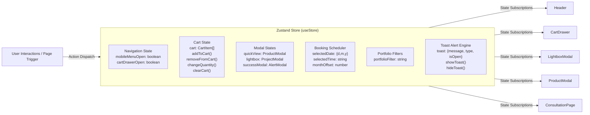
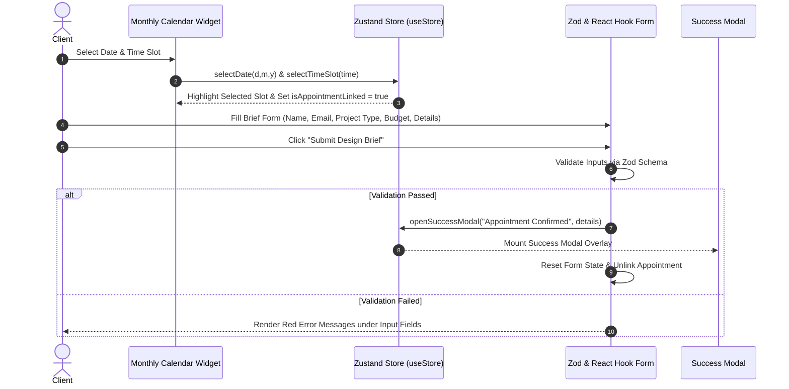

# MARK Architects — Codebase Flow, File Structure & Architectural Workflow

This document provides a comprehensive technical breakdown of the **MARK Architects** Next.js 16 application. Designed for developers and architects, it details the directory structure, routing hierarchy, state management pipeline, interactive component workflows, and Next.js 16 / React 19 execution patterns.

---

## 1. Executive Summary & Technology Stack

**MARK Architects** is an ultra-premium digital atelier and curated architectural collection store built with the modern Next.js App Router paradigm.

### Core Technology Stack

| Architecture Layer | Technology | Version | Key Responsibility |
| :--- | :--- | :--- | :--- |
| **Framework** | Next.js App Router | `16.2.9` | File-system routing, Server/Client component rendering, SEO metadata |
| **UI Library** | React | `19.2.4` | Component architecture, state hooks, React 19 concurrent features |
| **Language** | TypeScript | `5.x` | Strict type validation across models, props, and store states |
| **Styling** | Tailwind CSS v4 & PostCSS | `4.x` | Modern inline `@theme` token management, CSS variable bindings |
| **State Management** | Zustand | `5.0.14` | Unidirectional global client state (Cart, Modals, Scheduler, Toasts) |
| **Motion & Scroll** | Framer Motion & Lenis | `12.42.0` / `1.3.25` | Viewport entrance reveals, parallax interactions, smooth inertia scrolling |
| **Forms & Schemas** | React Hook Form & Zod | `7.80.0` / `4.4.3` | Type-safe form validation for consultation briefs |
| **Icons & Utilities** | Lucide React & `clsx` / `tailwind-merge` | `1.22.0` / `3.6.0` | Vector icon sets and clean dynamic CSS class merging |

---

## 2. Project File & Folder Directory Structure

Below is the complete tree layout of the workspace at `mark-archit/`:

```text
mark-archit/
├── app/                            # Next.js App Router Directory (Pages & Global Layout)
│   ├── about/                      # About Page (/about)
│   │   └── page.tsx                # Atelier legacy, leadership profiles & studio locations
│   ├── collection/                 # Architectural Collection Store (/collection)
│   │   └── page.tsx                # Artifact catalog, 3D OrbitViewer & product quick view
│   ├── consultation/               # Consultation & Booking (/consultation)
│   │   └── page.tsx                # Interactive appointment calendar & Zod design brief form
│   ├── portfolio/                  # Portfolio Gallery (/portfolio)
│   │   └── page.tsx                # Category filtered project grid with full-screen Lightbox
│   ├── services/                   # Architectural Domains (/services)
│   │   └── page.tsx                # 6 Principal services & detailed breakdown popups
│   ├── favicon.ico                 # Site Favicon
│   ├── globals.css                 # Tailwind CSS v4 configuration, theme variables & utilities
│   ├── layout.tsx                  # Root Layout (Google Fonts, Metadata, HTML shell)
│   └── page.tsx                    # Landing Page (Fullscreen parallax hero, metrics, philosophy)
├── components/                     # Reusable UI & Layout Components
│   ├── collection/                 # Store & 3D Visualizer Components
│   │   └── OrbitViewer.tsx         # Custom CSS 3D rotational product viewer (tilt/drag/zoom)
│   ├── consultation/               # Service & Booking Modals
│   │   └── ServicesPopup.tsx       # Detailed architectural service domain drawer/popup
│   ├── footer/                     # Global Page Footer
│   │   └── Footer.tsx              # Editorial footer with atelier locations & policy links
│   ├── layout/                     # Client Shell Layout
│   │   └── ClientLayout.tsx        # Global Lenis scroll initializer & modal container mount
│   ├── navigation/                 # Header & Navigation
│   │   ├── Header.tsx              # Sticky navbar, route indicator & cart counter trigger
│   │   └── MobileMenu.tsx          # Fullscreen sliding mobile navigation menu
│   └── ui/                         # Atomic & Dynamic Global UI Elements
│       ├── CartDrawer.tsx          # Slide-out shopping cart drawer & order summary
│       ├── LightboxModal.tsx       # High-resolution portfolio project viewer modal
│       ├── ProductModal.tsx        # Artifact Quick-View modal with specifications
│       ├── ScrollReveal.tsx        # Framer Motion scroll entrance reveal wrapper
│       ├── SuccessModal.tsx        # Transaction/Appointment verification popup
│       └── Toast.tsx               # Temporary floating alert notification banner
├── hooks/                          # Custom React Hooks & State Stores
│   └── useStore.ts                 # Unified Zustand Store (Cart, Modals, Booking, Toasts)
├── lib/                            # Helper Utilities & System Functions
│   └── utils.ts                    # `cn()` utility combining `clsx` and `tailwind-merge`
├── public/                         # Static Assets (Images, Icons, SVGs)
├── .gitignore                      # Git exclusion patterns
├── Brains.md                       # Architectural reference & legacy transformation history
├── eslint.config.mjs               # ESLint 9 configuration
├── next-env.d.ts                   # Next.js TypeScript declarations
├── next.config.ts                  # Next.js compiler & domain settings
├── package.json                    # Project manifest & dependency registry
├── postcss.config.mjs              # PostCSS setup for Tailwind CSS v4
├── README.md                       # Sanity CLI & studio documentation
└── tsconfig.json                   # TypeScript configuration & path aliases (`@/*`)
```

---

## 3. High-Level Architecture & System Workflow

The architecture follows a strict decoupled flow where **Server Layouts** inject structural metadata and font assets, passing client rendering control to a single top-level **Client Layout**. Global client state is centralized in **Zustand (`useStore.ts`)**, ensuring synchronized state across all routes, modals, and dynamic components.

### 3.1 Component Render Hierarchy & Structural Flow

```mermaid
graph TD
    RootLayout["app/layout.tsx (Server Layout)"] --> GoogleFonts["Google Fonts (Playfair, Inter, Montserrat)"]
    RootLayout --> Meta["SEO Metadata & OpenGraph Config"]
    RootLayout --> ClientLayout["components/layout/ClientLayout.tsx ('use client')"]
    
    ClientLayout --> LenisScroll["Lenis RAF Smooth Scroll Engine"]
    ClientLayout --> Header["components/navigation/Header.tsx"]
    ClientLayout --> MobileMenu["components/navigation/MobileMenu.tsx"]
    ClientLayout --> MainContent["Page Routing Content (<main>)"]
    ClientLayout --> Footer["components/footer/Footer.tsx"]
    
    ClientLayout --> GlobalModals["Global Modals & Drawers Layer"]
    GlobalModals --> CartDrawer["components/ui/CartDrawer.tsx"]
    GlobalModals --> ProductModal["components/ui/ProductModal.tsx"]
    GlobalModals --> LightboxModal["components/ui/LightboxModal.tsx"]
    GlobalModals --> SuccessModal["components/ui/SuccessModal.tsx"]
    GlobalModals --> Toast["components/ui/Toast.tsx"]
    
    MainContent --> PageHome["app/page.tsx (Home)"]
    MainContent --> PageAbout["app/about/page.tsx (About)"]
    MainContent --> PagePortfolio["app/portfolio/page.tsx (Portfolio)"]
    MainContent --> PageServices["app/services/page.tsx (Services)"]
    MainContent --> PageCollection["app/collection/page.tsx (Collection)"]
    MainContent --> PageConsultation["app/consultation/page.tsx (Consultation)"]
```



---

## 4. Detailed Data & State Flow (`hooks/useStore.ts`)

Global state is managed via **Zustand** inside [hooks/useStore.ts](file:///Users/muhammadrafiq/Desktop/ZiriumAI/projects/mark-archit/hooks/useStore.ts). This store manages 6 distinct domains:



### State Store Breakdown & Methods

1. **Navigation Control**:
   - `mobileMenuOpen` / `toggleMobileMenu()`: Manages mobile overlay drawer visibility.
   - `cartDrawerOpen` / `toggleCartDrawer()`: Controls slide-out shopping cart.
2. **E-Commerce Cart Engine**:
   - `cart`: Array of `CartItem` (`title`, `price`, `image`, `quantity`, `currency`).
   - `addToCart(item)`: Increments existing item quantity or appends new item. Automatically triggers `showToast()`.
   - `removeFromCart(index)`: Removes item at given index and triggers confirmation toast.
   - `changeQuantity(index, delta)`: Adjusts quantity with a min bound of 1.
   - `clearCart()`: Empties cart upon checkout completion.
3. **Modal & Lightbox Viewers**:
   - `openQuickView(product)` / `closeQuickView()`: Opens artifact preview modal with specification data.
   - `openLightbox(project)` / `closeLightbox()`: Opens full-screen portfolio image viewer.
   - `openSuccessModal(title, description)` / `closeSuccessModal()`: Displays confirmation popups post-checkout or appointment submission.
4. **Consultation Scheduler State**:
   - `booking`: Stores `selectedDate`, `selectedTime`, and `monthOffset`.
   - `selectDate(day, month, year)`, `selectTimeSlot(time)`, `changeMonth(dir)`: Coordinates interactive calendar picking.
   - `isAppointmentLinked` / `setAppointmentLinked()`: Binds calendar selection to the consultation design brief.
5. **Toast Notification System**:
   - `showToast(message, type)`: Displays non-intrusive bottom-right toast banner with an auto-dismiss timeout (3000ms).

---

## 5. Page-by-Page Workflow & Routing Details

### 5.1 Landing Page ([app/page.tsx](file:///Users/muhammadrafiq/Desktop/ZiriumAI/projects/mark-archit/app/page.tsx))
- **Role**: Brand showcase & primary conversion page.
- **Workflow**:
  1. **Parallax Hero**: Tracks `window.scrollY` via `useEffect` to execute smooth CSS background translation (`translateY(scrollY * 0.16px)`).
  2. **Hero Typography Outline**: Layered transparent SVG/CSS outline font (`MARK`) for visual impact.
  3. **Floating Statistics**: 4 stat panels displaying key metrics (15+ Years, 200+ Masterpieces, etc.).
  4. **Philosophy & Atelier Principles**: 4 core values cards (*Precision Fabrication*, *Sustainable Legacy*, *Contextual Harmony*, *Client Confidentiality*).
  5. **Selected Works Preview**: Carousel showcase with category tags. Clicking a project navigates to `/portfolio`.
  6. **Client Testimonials & CTAs**: Editorial quotes leading users to `/consultation` or `/collection`.

### 5.2 About Page ([app/about/page.tsx](file:///Users/muhammadrafiq/Desktop/ZiriumAI/projects/mark-archit/app/about/page.tsx))
- **Role**: Firm history, leadership ethos, and physical atelier locations.
- **Workflow**:
  1. **Founders Narrative**: Detailed bio sections for **Marcus Vance** (Principal Architect) and **Ayla Sterling** (Director of Interior Architecture).
  2. **Timeline History**: Milestones spanning from 2009 founding in Zurich to global expansion in 2024.
  3. **Global Atelier Maps**: Interactive tabs detailing office addresses, contact specs, and local team sizes for **Zurich (HQ)**, **London Atelier**, and **Tokyo Studio**.

### 5.3 Portfolio Page ([app/portfolio/page.tsx](file:///Users/muhammadrafiq/Desktop/ZiriumAI/projects/mark-archit/app/portfolio/page.tsx))
- **Role**: Filterable project gallery with full-resolution Lightbox overlay.
- **Workflow**:
  1. **Filter Selector**: State-driven category pills (`all`, `residential`, `commercial`, `interior`, `landscape`). Selecting a category filters the displayed grid instantly via Framer Motion animations.
  2. **Project Card Interaction**: Hovering triggers smooth image zoom and reveals project metadata (Location, Completion Year, Scale).
  3. **Lightbox Trigger**: Clicking any project triggers `openLightbox(project)` from `useStore`, populating [components/ui/LightboxModal.tsx](file:///Users/muhammadrafiq/Desktop/ZiriumAI/projects/mark-archit/components/ui/LightboxModal.tsx) with high-res photography and technical details.

### 5.4 Services Page ([app/services/page.tsx](file:///Users/muhammadrafiq/Desktop/ZiriumAI/projects/mark-archit/app/services/page.tsx))
- **Role**: Showcases 6 core architectural offerings.
- **Workflow**:
  1. **Service Grid**: Renders cards for *Architectural Masterplanning*, *Luxury Residential Design*, *Commercial & Cultural Ateliers*, *Interior Architecture & Curation*, *Sustainable & Passive Design*, and *Historic Restoration*.
  2. **Services Popup Integration**: Clicking "Explore Domain Scope" opens [components/consultation/ServicesPopup.tsx](file:///Users/muhammadrafiq/Desktop/ZiriumAI/projects/mark-archit/components/consultation/ServicesPopup.tsx), providing deep structural insights, deliverables, and typical timelines.

### 5.5 Collection Store Page ([app/collection/page.tsx](file:///Users/muhammadrafiq/Desktop/ZiriumAI/projects/mark-archit/app/collection/page.tsx))
- **Role**: E-Commerce boutique for bespoke architectural artifacts and furniture blueprints.
- **Workflow**:
  1. **Interactive 3D Orbit Visualizer**: Embedded [components/collection/OrbitViewer.tsx](file:///Users/muhammadrafiq/Desktop/ZiriumAI/projects/mark-archit/components/collection/OrbitViewer.tsx). Allows mouse drag/scroll rotation of obsidian hardware and lounge chair models without Three.js overhead.
  2. **Product Catalog Grid**: Product items with pricing, category tags, and instant "Add to Collection" buttons.
  3. **Quick-View Modal**: Clicking "Quick View" dispatches `openQuickView(product)`, mounting [components/ui/ProductModal.tsx](file:///Users/muhammadrafiq/Desktop/ZiriumAI/projects/mark-archit/components/ui/ProductModal.tsx).
  4. **Cart Integration**: Dispatches `addToCart()`, updating `cart` in `useStore` and opening [components/ui/CartDrawer.tsx](file:///Users/muhammadrafiq/Desktop/ZiriumAI/projects/mark-archit/components/ui/CartDrawer.tsx).

### 5.6 Consultation & Scheduling Page ([app/consultation/page.tsx](file:///Users/muhammadrafiq/Desktop/ZiriumAI/projects/mark-archit/app/consultation/page.tsx))
- **Role**: Appointment scheduling calendar paired with a validated design brief submission form.
- **Workflow**:



---

## 6. Dynamic & Interactive Component Engine

### 6.1 `OrbitViewer.tsx` (CSS 3D Engine)
- **Location**: [components/collection/OrbitViewer.tsx](file:///Users/muhammadrafiq/Desktop/ZiriumAI/projects/mark-archit/components/collection/OrbitViewer.tsx)
- **Mechanics**: Implements custom lightweight 3D rotation using native HTML/CSS spatial transforms instead of heavy WebGL libraries.
- **Transform Pipeline**:
  - Pointer events (`onMouseDown`, `onMouseMove`, `onMouseUp`) compute cursor delta `(dx, dy)`.
  - Rotational angles `rotateX` and `rotateY` map dynamically to inline CSS:
    ```css
    transform: perspective(1000px) rotateY(${rotation.y}deg) rotateX(${rotation.x}deg) scale(${zoom});
    ```
  - Smooth inertia recovery resets the model orientation when the user releases dragging.

### 6.2 `ScrollReveal.tsx` (Motion Wrapper)
- **Location**: [components/ui/ScrollReveal.tsx](file:///Users/muhammadrafiq/Desktop/ZiriumAI/projects/mark-archit/components/ui/ScrollReveal.tsx)
- **Mechanics**: Wraps arbitrary children in a Framer Motion `motion.div`. Uses `whileInView` observers to trigger vertical slide-ins (`translateY: 40px` -> `0px`) and fade-ins (`opacity: 0` -> `1`) with configurable delay and duration.

### 6.3 `ClientLayout.tsx` & Lenis Kinetic Scrolling
- **Location**: [components/layout/ClientLayout.tsx](file:///Users/muhammadrafiq/Desktop/ZiriumAI/projects/mark-archit/components/layout/ClientLayout.tsx)
- **Mechanics**: Initializes `Lenis` smooth scroll engine inside a `useEffect` hook:
  ```typescript
  const lenis = new Lenis({
    duration: 1.2,
    easing: (t) => Math.min(1, 1.001 - Math.pow(2, -10 * t)),
    smoothWheel: true,
  });
  ```
  Runs a recursive `requestAnimationFrame` loop to smooth out native browser wheel scrolling across touchpads and mice.

---

## 7. Styling System & Theme Registry (`globals.css`)

Tailwind CSS v4 introduces in-CSS `@theme` declarations inside [app/globals.css](file:///Users/muhammadrafiq/Desktop/ZiriumAI/projects/mark-archit/app/globals.css).

### Key Design Tokens

```css
@theme {
  --color-surface: #fcf8f8;
  --color-surface-container: #f1edec;
  --color-on-surface: #1c1b1b;
  --color-tertiary: #7e5714;               /* Luxury Bronze Accent */
  --color-tertiary-fixed: #ffdda1;
  --color-tertiary-fixed-dim: #e4c187;
  --color-on-tertiary: #ffffff;
  
  --font-playfair: var(--font-playfair);   /* Serif Display */
  --font-inter: var(--font-inter);         /* Body Sans-Serif */
  --font-montserrat: var(--font-montserrat);/* Geometric Accents */
  
  --spacing-margin-desktop: 80px;
  --spacing-container-max: 1440px;
}
```

### Custom Utility Classes
- **`.glass-panel`**: White glassmorphism card (`background: rgba(255, 255, 255, 0.45)`, `backdrop-filter: blur(24px)`, subtle border).
- **`.glass-panel-dark`**: Dark glassmorphism card (`background: rgba(20, 20, 20, 0.65)`, `backdrop-filter: blur(24px)`).
- **`.hero-text-outline`**: Text stroke style creating massive transparent architectural background headers.

---

## 8. Summary of File Responsibilities & Interaction Matrix

| File Path | Component / Layer | Primary Responsibility | Dependencies / Interactions |
| :--- | :--- | :--- | :--- |
| [app/layout.tsx](file:///Users/muhammadrafiq/Desktop/ZiriumAI/projects/mark-archit/app/layout.tsx) | Server Layout | Configures Google Fonts, site HTML shell, and global metadata | Passes DOM children into `ClientLayout` |
| [components/layout/ClientLayout.tsx](file:///Users/muhammadrafiq/Desktop/ZiriumAI/projects/mark-archit/components/layout/ClientLayout.tsx) | Client Root Shell | Mounts Lenis scroll loop, Header, Footer, and top-level Drawers | Wraps all sub-pages; imports `useStore` driven modals |
| [components/navigation/Header.tsx](file:///Users/muhammadrafiq/Desktop/ZiriumAI/projects/mark-archit/components/navigation/Header.tsx) | Header Navigation | Sticky top navbar, route links, cart item badge, menu trigger | Subscribes to `cart` length and `toggleCartDrawer` |
| [hooks/useStore.ts](file:///Users/muhammadrafiq/Desktop/ZiriumAI/projects/mark-archit/hooks/useStore.ts) | Zustand Store | Single source of truth for UI states, cart, modals, toasts | Consumed by 12+ components across app |
| [components/ui/CartDrawer.tsx](file:///Users/muhammadrafiq/Desktop/ZiriumAI/projects/mark-archit/components/ui/CartDrawer.tsx) | Slide Drawer | Cart item manipulation, subtotal calculation, checkout trigger | Reads/mutates `useStore` cart array |
| [components/collection/OrbitViewer.tsx](file:///Users/muhammadrafiq/Desktop/ZiriumAI/projects/mark-archit/components/collection/OrbitViewer.tsx) | 3D CSS Canvas | Mouse tilt, drag, and zoom for 3D hardware artifacts | Embedded on `/collection` page |
| [components/consultation/ServicesPopup.tsx](file:///Users/muhammadrafiq/Desktop/ZiriumAI/projects/mark-archit/components/consultation/ServicesPopup.tsx) | Drawer Modal | Deep-dive domain deliverables modal for architectural services | Triggered from `/services` page |
| [app/consultation/page.tsx](file:///Users/muhammadrafiq/Desktop/ZiriumAI/projects/mark-archit/app/consultation/page.tsx) | Interactive View | Consultation calendar booking and Zod validated brief form | Updates `booking` state in `useStore` |

---

## 9. Next.js Developer Best Practices & Operational Guidelines

1. **Server vs. Client Component Boundaries**:
   - Keep `layout.tsx` clean as a Server Component for optimal head injection and static font optimization.
   - Use `'use client'` only at interactive boundaries (e.g. `ClientLayout.tsx`, dynamic form pages, and components consuming `useStore`).
2. **State Management Discipline**:
   - Do not pass heavy state down multi-level prop chains. Always leverage `useStore` selectors (e.g. `const cart = useStore((state) => state.cart)`).
3. **Smooth Scroll Isolation**:
   - Lenis smooth scrolling is controlled globally inside `ClientLayout.tsx`. Avoid adding duplicate custom scroll listeners on window unless necessary.
4. **Image & Resource Optimization**:
   - Utilize Next.js `<Image />` component with `fill` and explicit `sizes` props to ensure proper srcset generation and cumulative layout shift (CLS) prevention.
