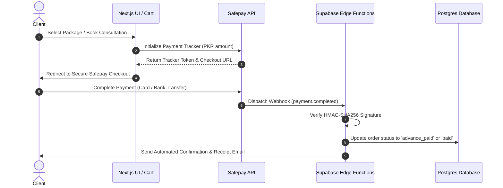

# MARK Architects — Codebase Flow, File Structure & Architectural Workflow

This document provides a comprehensive technical breakdown of the **MARK Architects** Next.js 16 application. Designed for developers and architects, it details the directory structure, routing hierarchy, state management pipeline, interactive component workflows, database schemas, and Safepay payment gateway integration.

---

## 1. Executive Summary & Authoritative Business Stack

**MARK Architects** is an ultra-premium digital atelier and architectural services platform built with the modern Next.js App Router paradigm.

### Core Technology Stack

| Architecture Layer   | Technology                  | Version              | Key Responsibility                                                                             |
| :------------------- | :-------------------------- | :------------------- | :--------------------------------------------------------------------------------------------- |
| **Framework**        | Next.js App Router          | `16.2.9`             | File-system routing, Server/Client component rendering, SEO metadata                           |
| **UI Library**       | React                       | `19.2.4`             | Component architecture, state hooks, React 19 concurrent features                              |
| **Language**         | TypeScript                  | `5.x`                | Strict type validation across models, props, and store states                                  |
| **Styling**          | Tailwind CSS v4 & PostCSS   | `4.x`                | Modern inline `@theme` token management, CSS variable bindings                                 |
| **State Management** | Zustand                     | `5.0.14`             | Unidirectional global client state (Cart, Modals, Scheduler, Toasts)                           |
| **Payment Gateway**  | **Safepay API**             | `v1`                 | **Primary payment processor** for all PKR transactions, calls, packages & 50% advance deposits |
| **Database & Auth**  | Supabase (PostgreSQL + RLS) | `v2`                 | Schema for services, tiers, plot-based pricing rules, consultations & orders                   |
| **File Storage**     | Supabase Storage            | `v2`                 | `client-attachments` bucket (25MB max) for architectural drawings & site photos                |
| **Motion & Scroll**  | Framer Motion & Lenis       | `12.42.0` / `1.3.25` | Viewport entrance reveals, parallax interactions, smooth inertia scrolling                     |
| **Forms & Schemas**  | React Hook Form & Zod       | `7.80.0` / `4.4.3`   | Type-safe form validation for consultation briefs & mandatory file attachments                 |

---

## 2. Authoritative Service Catalog & Pricing Models

All prices are standardized in **Pakistani Rupees (PKR)** and categorized by one of three pricing mechanics: `flat`, `size_based` (5 Marla / 10 Marla / 1 Kanal), or `rate_formula` (Covered Area sq. ft. × Discipline Rate).

### Catalog Matrix

| Service Name                                       | Pricing Type   | Tiers / Plots                                                                                                     | Price (PKR)                                                                  | Key Rules                                                                           |
| :------------------------------------------------- | :------------- | :---------------------------------------------------------------------------------------------------------------- | :--------------------------------------------------------------------------- | :---------------------------------------------------------------------------------- |
| **A) Online Consultation (Video / Call)**          | `flat`         | Basic Call (30 min)<br>Premium Call (60 min)                                                                      | 3,000<br>5,000                                                               | **Mandatory file/photo attachment** required before call confirmation.              |
| **B) House Plan Review**                           | `flat`         | Basic (24 hrs)<br>Standard (24–48 hrs)<br>Premium (48 hrs)                                                        | 5,000<br>9,000<br>24,000                                                     | Voice notes, marked PDF/JPG plans, issue diagnostics.                               |
| **C) House Plan Correction**                       | `size_based`   | Basic<br>Standard<br>Premium                                                                                      | **5M / 10M / 1K**<br>10k / 15k / 26k<br>15k / 22k / 40k<br>22k / 38k / 70k   | Plot-scale optimization with furniture and natural ventilation strategies.          |
| **D) Front Elevation 3D (Exterior Render)**        | `size_based`   | Basic<br>Standard<br>Premium                                                                                      | **5M / 10M / 1K**<br>15k / 17k / 23k<br>20k / 25k / 31.9k<br>25k / 29k / 36k | 3D realistic facade renders, daylight & night lighting illumination.                |
| **E) Interior Room Makeover**                      | `flat`         | Basic<br>Standard<br>Premium                                                                                      | 7,000<br>12,000<br>30,000                                                    | Moodboard, 2D furniture plan, 3D renders, and ceiling details.                      |
| **F) Construction Cost Estimate (Grey Structure)** | `size_based`   | Basic<br>Detailed                                                                                                 | **5M / 10M / 1K**<br>5k / 7k / 9k<br>16k / 19k / 30k                         | Bill of quantities, steel, cement and brick schedules.                              |
| **G) Full House Design Package**                   | `rate_formula` | Architectural: 40/sqft<br>Structural: 8/sqft<br>Plumbing: 3.5/sqft<br>Electrical: 4.5/sqft<br>Fire/Safety: 1/sqft | Dynamic per sq. ft.<br>(All 5 = 57 PKR/sqft)                                 | **50% advance required** before drafting starts. Extra revisions billed separately. |

---

## 3. Project File & Folder Directory Structure

```text
mark-archit/
├── app/                            # Next.js App Router Directory (Pages & Global Layout)
│   ├── about/                      # About Page (/about) - Leadership, credentials & studio locations
│   ├── collection/                 # Packages & Collection Store (/collection) - Direct checkout & 3D OrbitViewer
│   ├── consultation/               # Consultation & Booking (/consultation) - Mandatory file uploads & call tiers
│   ├── portfolio/                  # Portfolio Gallery (/portfolio) - Category filtered grid with Lightbox
│   ├── services/                   # Service Catalog (/services) - 7 Approved services, tier picker & Quote Calculator
│   ├── layout.tsx                  # Root Layout (Google Fonts, Metadata, HTML shell)
│   ├── globals.css                 # Tailwind CSS v4 configuration, theme variables & utilities
│   └── page.tsx                    # Landing Page (Fullscreen parallax hero, metrics, philosophy)
├── components/                     # Reusable UI & Layout Components
│   ├── calculator/                 # Live Dynamic Pricing Calculators
│   │   └── FullHouseCalculator.tsx # Interactive covered area × discipline quote engine with 50% advance terms
│   ├── collection/                 # Store & 3D Visualizer Components
│   │   └── OrbitViewer.tsx         # Custom CSS 3D rotational product viewer
│   ├── footer/                     # Global Page Footer
│   │   └── Footer.tsx              # Editorial footer with atelier locations & policy links
│   ├── layout/                     # Client Shell Layout
│   │   └── ClientLayout.tsx        # Global Lenis scroll initializer & modal container mount
│   ├── navigation/                 # Header & Navigation
│   │   ├── Header.tsx              # Sticky navbar, route indicator & cart counter trigger
│   │   └── MobileMenu.tsx          # Fullscreen sliding mobile navigation menu
│   └── ui/                         # Atomic & Dynamic Global UI Elements
│       ├── CartDrawer.tsx          # Slide-out shopping cart drawer with PKR sums & Safepay checkout
│       ├── LightboxModal.tsx       # High-resolution portfolio project viewer modal
│       ├── ProductModal.tsx        # Artifact Quick-View modal with specifications
│       ├── ScrollReveal.tsx        # Framer Motion scroll entrance reveal wrapper
│       ├── SuccessModal.tsx        # Transaction/Appointment verification popup
│       └── Toast.tsx               # Temporary floating alert notification banner
├── hooks/                          # Custom React Hooks & State Stores
│   └── useStore.ts                 # Unified Zustand Store (Cart, Safepay, Call Tiers, Attachments, Toasts)
├── lib/                            # Helper Utilities & System Functions
│   ├── safepay.ts                  # Safepay API client, 50% advance deposit math & PKR formatting
│   └── utils.ts                    # cn() utility combining clsx and tailwind-merge
├── public/                         # Static Assets & Approved Service Images
│   └── images/                     # Service illustrations (For Call, Plan Review, 3D Elevation, etc.)
├── supabase/                       # Database Configurations
│   └── schema.sql                  # Complete PostgreSQL DDL with RLS policies and authoritative seed data
├── PROJECT_STRUCTURE_AND_WORKFLOW.md # Full architecture & workflow specification
├── Brains.md                       # Architectural reference & transformation history
├── package.json                    # Project manifest & dependency registry
└── tsconfig.json                   # TypeScript configuration & path aliases (@/*)
```

---

## 4. Payment & Checkout Architecture: Safepay Integration

**Safepay** is the designated gateway for all online payments.

### 4.1 Payment Flows



### 4.2 50% Advance Handling (Full House Design Package)

- The _Full House Design Package_ requires a mandatory 50% advance before architectural and structural drafting begins.
- `SafepayService.calculateAdvanceDeposit(totalAmount)` automatically derives the exact deposit and remaining balance.
- Order is stored with `payment_type = '50_percent_advance'` and `payment_status = 'advance_paid'`. Remaining balance is invoiced upon final delivery approval.

---

## 5. Consultation & Mandatory Drawing Attachment Workflow

Consultations cannot be finalized without an attached file or site photo:

1. **Step 1: Scope Selection**: Client selects either **Basic Call (PKR 3,000 / 30 min)** or **Premium Call (PKR 5,000 / 60 min)**.
2. **Step 2: Calendar Slot Selection**: Interactive calendar picker locks slot in Pakistan Standard Time (PKT).
3. **Step 3: Mandatory Drawing Upload**:
   - File input accepts `.pdf`, `.jpg`, `.jpeg`, `.png`, `.zip`, `.dwg` up to **25MB**.
   - Form submission is guarded: if no file is selected, submission is rejected and user is prompted with an error banner.
4. **Step 4: Safepay Checkout**: Client confirms booking and proceeds to payment.

---

## 6. Phase 3.2 Handover & Transfer Checklist

Upon final project approval, repository and infrastructure management transfers formally to the client:

- [ ] **GitHub Repository Ownership**: Transfer repo to client's GitHub organization or account.
- [ ] **Vercel Production Deployment**: Transfer Vercel project and production domain DNS records.
- [ ] **Supabase Organization & Database**: Transfer Supabase project ownership, database credentials, and service role keys.
- [ ] **Safepay Production Keys**: Rotate from Sandbox keys to client's verified Safepay Merchant Production keys (`API_KEY`, `V1_SECRET`, `WEBHOOK_SECRET`).
- [ ] **DNS & SSL Handover**: Hand over Cloudflare / Namecheap / GoDaddy nameserver management.
