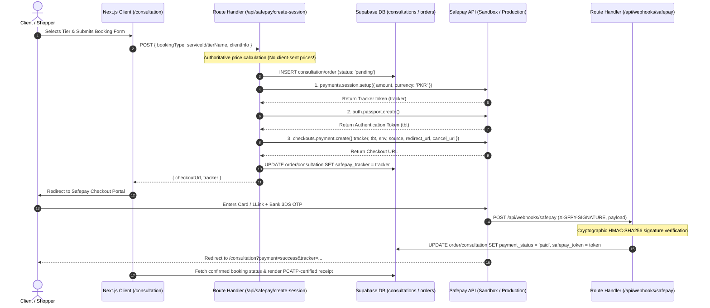

# Safepay Express Checkout Integration Plan

This document outlines the complete architectural design, security guidelines, and step-by-step implementation plan for integrating **Safepay Express Checkout** (`@sfpy/node-core`) with **Next.js 16 (App Router)** and **Supabase** for **MARK Architects**.

---

## 1. Executive Summary & Architecture Decision

### Why Safepay Express Checkout?

Safepay provides two main integration approaches:

1. **Express Checkout (Hosted / Popup Redirect)**: **RECOMMENDED**
   - **Maximum Security (Zero PCI Scope - SAQ-A)**: Your application never touches, processes, or stores sensitive credit/debit card numbers or CVVs.
   - **Automated 3D Secure (3DS / OTP)**: All bank OTP challenges, biometric authentications, and Mastercard Identity Check / Visa Secure flows are handled directly on Safepay’s PCI-DSS Level 1 compliant domain (`getsafepay.com`).
   - **Fastest Performance**: Requires only **2 server-side API calls** (`payments.session.setup` + `auth.passport.create`) before redirecting the customer (~200ms total latency).
   - **Zero Bundle Overhead**: Adds **0 KB** of client-side JavaScript to your Next.js application, preserving Core Web Vitals and Largest Contentful Paint (LCP).

2. **Advanced Checkout (Safepay Atoms / Cardinal)**:
   - Requires embedding custom card iframes, managing Cardinal Cruise 3DS hooks, higher PCI compliance audits (SAQ A-EP), and 4–8 roundtrips.

---

## 2. Security & Compliance Blueprint

To ensure the integration is safe and production-ready:

1. **Server-Only Isolation (`lib/server/safepay.ts`)**:
   - Guard the Safepay SDK wrapper with `import 'server-only'`.
   - Never import `@sfpy/node-core` or merchant secrets into Client Components (`"use client"`).
   - Enforce `export const runtime = 'nodejs'` on all Safepay Route Handlers.

2. **Authoritative Server-Side Pricing (Prevent Price Tampering)**:
   - The frontend client **never** sends price numbers or total PKR amounts.
   - The client only submits identifiers (`serviceId`, `tierId`, `callTier`, `bookingDate`).
   - The Next.js server calculates the exact PKR amount and 50% advance deposit from authoritative data (`servicesData.ts` / database).

3. **Database State Machine & Idempotency**:
   - Before redirecting to Safepay, insert a row into Supabase (`consultations` or `orders`) with `status: 'pending'`.
   - Store the generated `safepay_tracker` token on that record.

4. **Cryptographic HMAC Webhook Verification (Single Source of Truth)**:
   - Never mark an order as paid solely based on the user landing on a return URL (`/order/success?tracker=...`), because URLs can be visited manually or forged.
   - Authoritative fulfillment occurs via Safepay’s server-to-server webhook (`POST /api/webhooks/safepay`).
   - Validate the `x-sfpy-signature` header using `crypto.createHmac('sha256', process.env.SAFEPAY_WEBHOOK_SECRET)` on the exact raw string body (`await req.text()`).

---

## 3. End-to-End Sequence Diagram



---

## 4. Implementation Steps & File Structure

### Step 1: Install Required Dependencies

```bash
npm install @sfpy/node-core server-only
```

### Step 2: Environment Variables (`.env.local`)

```env
# Safepay Merchant Credentials (Private - Server Only)
SAFEPAY_API_KEY=sec_...
SAFEPAY_V1_SECRET=sec_...
SAFEPAY_WEBHOOK_SECRET=sec_...
SAFEPAY_ENV=sandbox # switch to 'production' for live payments

# Public Variables
NEXT_PUBLIC_SAFEPAY_API_KEY=sec_...
NEXT_PUBLIC_APP_URL=http://localhost:3000
```

### Step 3: Server-Isolated Client (`lib/server/safepay.ts`)

```typescript
import "server-only";
import crypto from "crypto";
// @ts-ignore
import createSafepay from "@sfpy/node-core";

const isProduction = process.env.SAFEPAY_ENV === "production";

export const safepayClient = createSafepay(process.env.SAFEPAY_V1_SECRET!, {
  authType: "secret",
  host: isProduction
    ? "https://api.getsafepay.com"
    : "https://sandbox.api.getsafepay.com",
});

export const safepayEnv: "sandbox" | "production" = isProduction
  ? "production"
  : "sandbox";

/**
 * Validates HMAC SHA-256 webhook signature from Safepay
 */
export function verifySafepayWebhook(
  rawBody: string,
  signature: string,
): boolean {
  const secret = process.env.SAFEPAY_WEBHOOK_SECRET;
  if (!secret || !signature) return false;

  const expectedSignature = crypto
    .createHmac("sha256", secret)
    .update(rawBody)
    .digest("hex");

  return crypto.timingSafeEqual(
    Buffer.from(signature, "utf8"),
    Buffer.from(expectedSignature, "utf8"),
  );
}
```

### Step 4: Checkout Session Route Handler (`app/api/safepay/create-session/route.ts`)

```typescript
import { NextRequest, NextResponse } from "next/server";
import { safepayClient, safepayEnv } from "@/lib/server/safepay";
import { SERVICES, getStartingPriceText } from "@/lib/servicesData";
import { createClient } from "@/utils/supabase/server";
import { cookies } from "next/headers";

export const runtime = "nodejs";

export async function POST(req: NextRequest) {
  try {
    const body = await req.json();
    const { type, clientInfo, serviceId, tierId, callTier } = body;

    let amountPkr = 0;
    let description = "";

    // Authoritative pricing check
    if (type === "consultation") {
      if (callTier === "Basic Call") amountPkr = 15000;
      else if (callTier === "Premium Call") amountPkr = 35000;
      else amountPkr = 75000;
      description = `MARK Architects — ${callTier} Consultation`;
    } else {
      const service = SERVICES.find((s) => s.id === serviceId);
      const tier = service?.tiers.find((t) => t.id === tierId);
      if (!tier) {
        return NextResponse.json(
          { error: "Invalid service tier" },
          { status: 400 },
        );
      }
      const isAdvance = service?.paymentTerms?.type === "advance_50";
      amountPkr = isAdvance ? Math.round(tier.price * 0.5) : tier.price;
      description = `MARK Architects — ${service?.title} (50% Advance)`;
    }

    // 1. Create pending record in Supabase
    const cookieStore = await cookies();
    const supabase = createClient(cookieStore);

    const { data: record, error: dbError } = await supabase
      .from(type === "consultation" ? "consultations" : "orders")
      .insert({
        client_name: clientInfo.name,
        client_email: clientInfo.email,
        client_phone: clientInfo.phone,
        price_pkr: amountPkr,
        payment_status: "pending",
        tier_name: callTier || tierId,
        booking_date: clientInfo.date || new Date().toISOString().split("T")[0],
        booking_time: clientInfo.time || "14:00",
        attachment_urls: clientInfo.attachments || [],
      })
      .select()
      .single();

    if (dbError) throw dbError;

    // 2. Setup Safepay Payment Session
    const sessionRes = await safepayClient.payments.session.setup({
      merchant_api_key: process.env.SAFEPAY_API_KEY,
      intent: "CYBERSOURCE",
      mode: "payment",
      currency: "PKR",
      amount: amountPkr * 100, // Lowest denomination (paisa)
    });

    const tracker = sessionRes?.data?.tracker?.token;

    // 3. Create short-lived authentication token (passport)
    const passportRes = await safepayClient.auth.passport.create();
    const tbt = passportRes?.data;

    // 4. Generate Checkout URL
    const appUrl = process.env.NEXT_PUBLIC_APP_URL || "http://localhost:3000";
    const checkoutUrl = safepayClient.checkouts.payment.create({
      tracker,
      tbt,
      environment: safepayEnv,
      source: "hosted",
      redirect_url: `${appUrl}/consultation?payment=success&tracker=${tracker}&id=${record.id}`,
      cancel_url: `${appUrl}/consultation?payment=cancelled&id=${record.id}`,
    });

    // 5. Update record with tracker
    await supabase
      .from(type === "consultation" ? "consultations" : "orders")
      .update({ safepay_tracker: tracker })
      .eq("id", record.id);

    return NextResponse.json({ checkoutUrl, tracker, recordId: record.id });
  } catch (error: any) {
    console.error("Safepay session creation failed:", error);
    return NextResponse.json(
      { error: error.message || "Payment initiation failed" },
      { status: 500 },
    );
  }
}
```

### Step 5: Webhook Route Handler (`app/api/webhooks/safepay/route.ts`)

```typescript
import { NextRequest, NextResponse } from "next/server";
import { verifySafepayWebhook } from "@/lib/server/safepay";
import { createClient } from "@/utils/supabase/server";
import { cookies } from "next/headers";

export const runtime = "nodejs";

export async function POST(req: NextRequest) {
  try {
    const rawBody = await req.text(); // Raw body for exact HMAC signature matching
    const signature = req.headers.get("x-sfpy-signature") || "";

    // 1. Verify HMAC SHA-256 signature
    const isValid = verifySafepayWebhook(rawBody, signature);
    if (!isValid) {
      return NextResponse.json(
        { error: "Invalid webhook signature" },
        { status: 401 },
      );
    }

    const payload = JSON.parse(rawBody);
    const { tracker, status, token } = payload?.data || {};

    // 2. Fulfill order idempotently
    if (status === "PAID") {
      const cookieStore = await cookies();
      const supabase = createClient(cookieStore);

      // Check both consultations and orders
      await supabase
        .from("consultations")
        .update({
          payment_status: "paid",
          safepay_token: token,
          updated_at: new Date().toISOString(),
        })
        .eq("safepay_tracker", tracker);

      await supabase
        .from("orders")
        .update({
          payment_status: "advance_paid",
          safepay_token: token,
          updated_at: new Date().toISOString(),
        })
        .eq("safepay_tracker", tracker);
    }

    return NextResponse.json({ received: true });
  } catch (error: any) {
    console.error("Webhook error:", error);
    return NextResponse.json(
      { error: "Webhook processing error" },
      { status: 500 },
    );
  }
}
```

### Step 6: Frontend Integration (`app/consultation/page.tsx`)

- Attach the `POST /api/safepay/create-session` call to the booking form submit handler.
- Display a loading indicator while the payment session is initialized.
- Redirect the customer window: `window.location.href = data.checkoutUrl`.
- On return:
  - If URL contains `?payment=success&tracker=...`: show celebratory modal, PCATP verified badge, and calendar invite.
  - If URL contains `?payment=cancelled`: show toast or alert allowing easy retry.

---

## 5. Verification & Testing Checklist

- [ ] Install `@sfpy/node-core` and `server-only`.
- [ ] Add Sandbox credentials to `.env.local`.
- [ ] Run `npx tsc --noEmit` and `npm run lint` to verify zero type or lint errors.
- [ ] Test session creation endpoint using mock payload.
- [ ] Test webhook verification rejecting invalid signatures and accepting valid HMAC payloads.
- [ ] Test end-to-end user checkout on `/consultation`.
